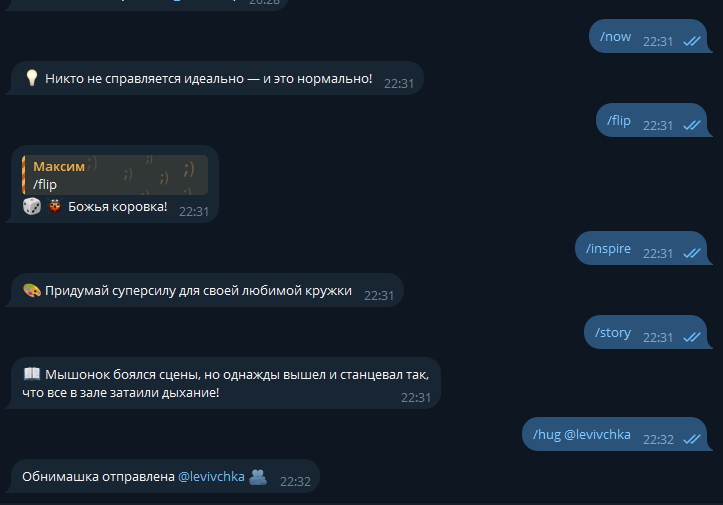

# 💬 Мотивационный Telegram-бот

Добро пожаловать в проект по созданию Telegram-бота, который распространяет поддержку, мотивацию и добрые объятия! 🤗  
Этот бот поможет поднять настроение вам и вашим друзьям, поддержит в трудную минуту и добавит чуточку света в повседневность.

## 📌 Оглавление

- [💬 Мотивационный Telegram-бот](#-мотивационный-telegram-бот)
  - [📌 Оглавление](#-оглавление)
  - [🧠 Описание проекта](#-описание-проекта)
  - [⚙️ Функциональность](#️-функциональность)
  - [🧰 Стек технологий](#-стек-технологий)
  - [🛠 Установка и запуск](#-установка-и-запуск)
  - [📁 Структура проекта](#-структура-проекта)
  - [💬 Примеры использования](#-примеры-использования)
  - [🧪 Модификации проекта](#-модификации-проекта)
  - [📊 Диаграммы и схемы](#-диаграммы-и-схемы)
    - [Архитектура бота](#архитектура-бота)
    - [Поток рассылки](#поток-рассылки)

---

## 🧠 Описание проекта

Цель проекта — создать Telegram-бота, способного:

- Отправлять случайные мотивационные цитаты
- Делать рассылку подписчикам
- Посылать мотивацию или объятия друзьям
- Работать с креативными идеями, скаЙзками и игривыми функциями

---

## ⚙️ Функциональность

Команды, доступные пользователям:

| Команда | Описание |
|--------|----------|
| `/start` | Запуск бота, регистрация пользователя |
| `/help` | Список доступных команд |
| `/now` | Получить случайную мотивационную цитату |
| `/subscribe` / `/unsubscribe` | Управление подпиской на рассылку |
| `/friend @username` | Отправить мотивацию другу |
| `/hug @username` | Обнять друга |
| `/flip` | Подбросить монетку (пчёлка или божья коровка) |
| `/story` | Получить добрую сказку |
| `/inspire` | Получить идею для творчества |
| `/donate` | Поддержать автора |

---

## 🧰 Стек технологий

- Язык: `Python`
- Библиотека для Telegram: [`pyTelegramBotAPI`](https://pypi.org/project/pyTelegramBotAPI/)
- Хранение данных: `JSON`
- Потоки: `threading`
- Формат документации: `Markdown`

---

## 🛠 Установка и запуск

1. Клонируйте репозиторий:
   ```bash
   git clone https://github.com/your-username/motivation-bot.git
   cd motivation-bot
   ```


3. Запустите бота:
   ```bash
   python main.py
   ```

> **Важно:** Указать собсвтенный TOKEN в коде, полученный в [@BotFather](https://t.me/BotFather)

---

## 📁 Структура проекта

```
.
├── .idea/
├── .venv/
├── data/
│   ├── messages.py       # Списки сообщений, историй и промптов
│   ├── user_data.json    # Пользовательские данные (ID, подписки)
├── main.py               # Основной файл бота
├── README.md             # Документация проекта
```

---

## 💬 Примеры использования



---

## 🧪 Модификации проекта

В рамках доработки проекта были добавлены:

- Адаптивная логика рассылки в зависимости от количества подписчиков
- Команда `/users` для отображения последних активных пользователей (только для админов)
- Расширение базы историй и креативных идей
- Улучшена проверка формата команд `/friend` и `/hug`

---

## 📊 Диаграммы и схемы

### Архитектура бота

```
Telegram User
     ⬇️
  Telegram API
     ⬇️
  pyTelegramBotAPI
     ⬇️
   main.py
   ├─ Обработка команд
   ├─ Чтение/запись JSON
   └─ Отправка сообщений
```

### Поток рассылки

```
Каждый час:
  └─ Проверка вероятности
      └─ Выбор случайных подписчиков
          └─ Отправка сообщений
```

---


> С любовью к коду и людям ❤️
